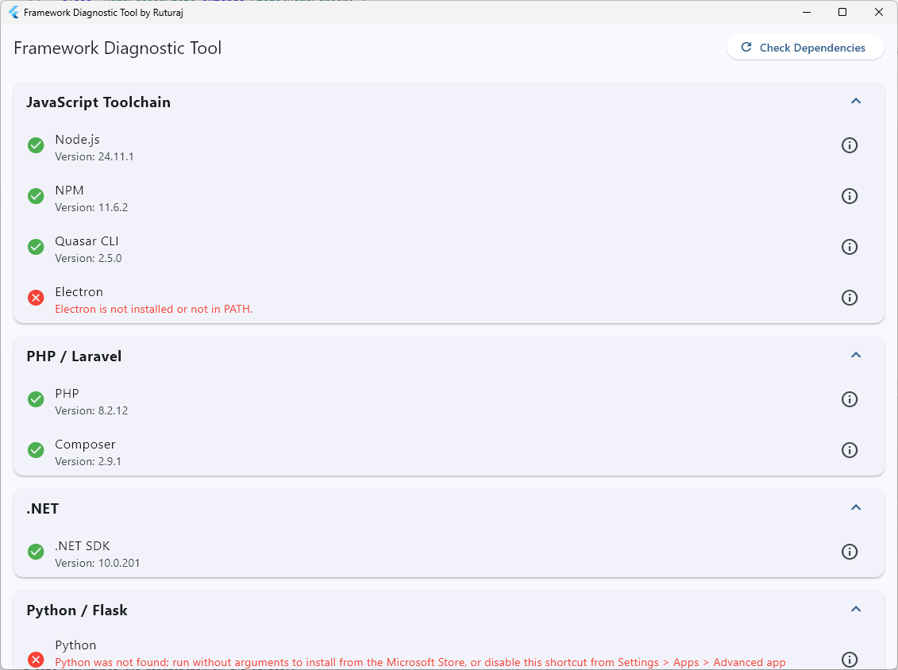

# Framework Diagnostic Tool



A modular Flutter Desktop tool for Windows that verifies the presence and versioning of common development toolchains.

## Purpose
This application and its underlying engine (`DependencyChecker`) are designed to provide a quick, automated way to check if required developer tools are installed on a Windows machine. It checks for:
- Standard software like **Node.js**, **Python**, **PHP**, and **.NET**.
- Mobile development tools such as **Java (JDK)**, **ADB**, and **Gradle**.
- CLI tools like **Composer**, **Quasar**, **Electron**, and **NPM**.

## Features
- **Deterministic Detection**: Relies strictly on command-line output and exit codes.
- **Async Execution**: Non-blocking results ensure the UI stays smooth.
- **Parallel Checking**: Batches dependencies to resolve multiple checks concurrently.
- **Raw Diagnostic View**: Access full logs/traces for each command to troubleshoot PATH issues.

---

## Supported Frameworks & Dependencies
- **SDK**: [Flutter 3.x+](https://flutter.dev)
- **Target OS**: Windows Only
- **External CLI required**: None (Uses `cmd.exe /c` under the hood)

---

## Getting Started

### 1. Prerequisite
Ensure you have the Flutter SDK installed and the `desktop` workload configured for Windows:
```powershell
flutter doctor
```

### 2. Installation
Clone the repository. Once done, go to the folder where you cloned the repo and fetch the dependencies.
```powershell
flutter pub get
```

### 3. Running (Debug/Desktop)
Run the application on your Windows machine:
```powershell
flutter run -d windows
```

### 4. Building for Production
To generate a standalone `.exe` release build:
```powershell
flutter build windows
```
The output file will be available at:
`build\windows\x64\runner\Release\dependency_checker.exe`

---

## Technical Documentation
For more details on the code architecture and how to integrate it into your own project, see:
[API Documentation](docs/dependency_checker_api.md)
